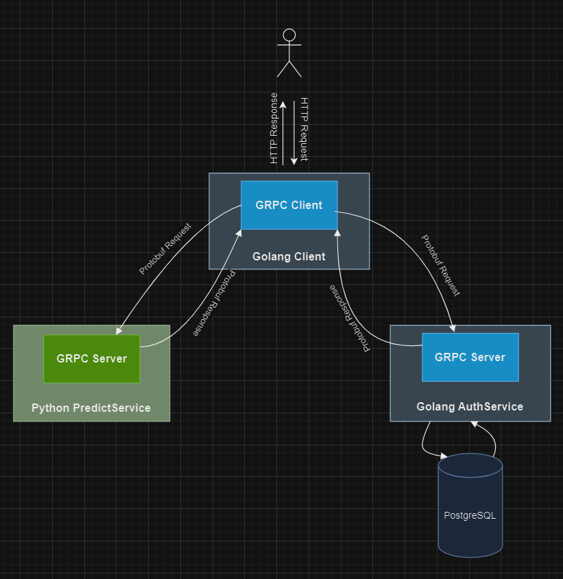

# Stock Predictor Service
Предсказатель акций, использующий **gRPC** для связи между сервисами на **Go** и **Python**.

## Структура проекта


Проект состоит из нескольких сервисов:

1. **Auth Service**: Сервис для регистрации и аутентификации пользователей, написан на **Golang**.
2. **Predictor Service**: Сервис, предоставляющий предсказания для акций, написан на **Python**.
3. **Client**: Веб-клиент для взаимодействия с сервисами.
4. **Database (PostgreSQL)**: Система для хранения данных пользователей.

Проект запускается с помощью **Docker Compose**.

## Требования

### Убедитесь, что у вас установлен Docker и Docker Compose.

Для установки Docker и Docker Compose:

- [Docker для Windows](https://docs.docker.com/desktop/setup/install/windows-install/)
- [Docker для macOS](https://docs.docker.com/desktop/setup/install/mac-install/)
- [Docker для Linux](https://docs.docker.com/engine/install/)

## Запуск проекта

1. **Клонирование репозитория**:

   Клонируйте репозиторий с проектом:

   ```bash
   git clone https://github.com/MonoBear123/proto.git
   
2. **Сборка и запуск сервисов**
   Перейдите в корневую директорию проекта и выполните команду для сборки и запуска всех сервисов с помощью Docker Compose:

   ```bash
   docker-compose up

3 **Доступ к сервисам**
После успешного запуска контейнеров, сервисы будут доступны по следующим портам:

- Auth Service будет доступен на порту 42022.
- Predictor Service будет доступен на порту 42020.
- Client будет доступен на порту 8080.
     
